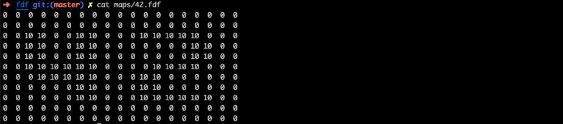
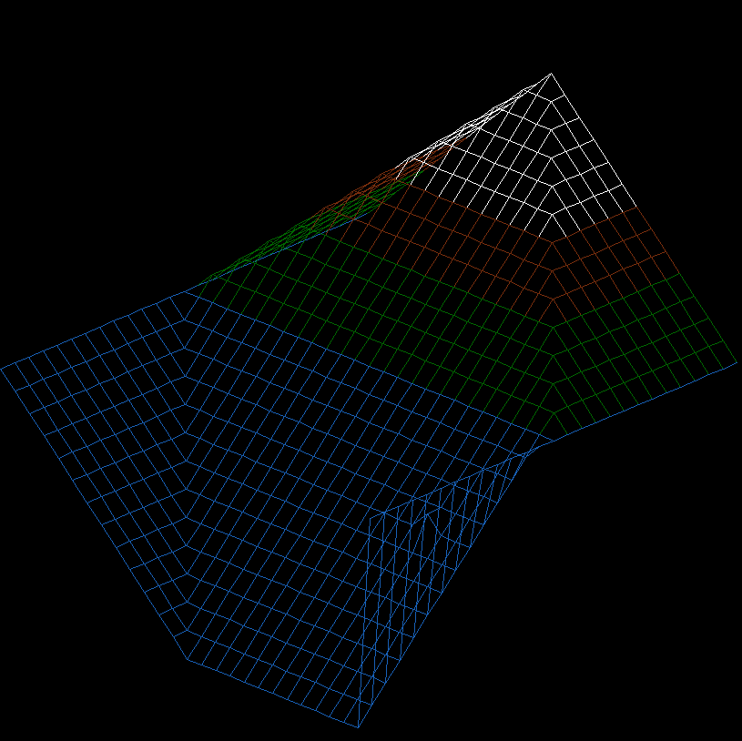
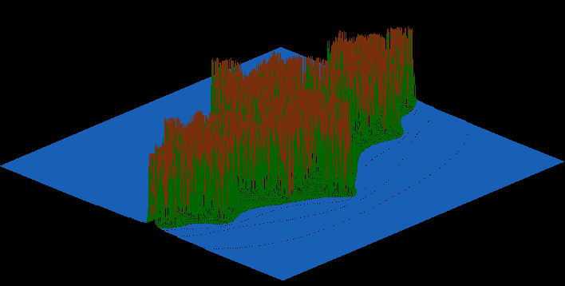
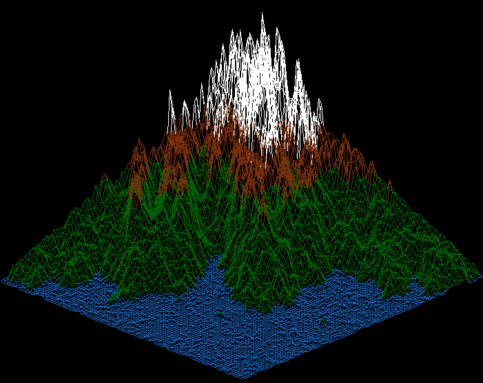
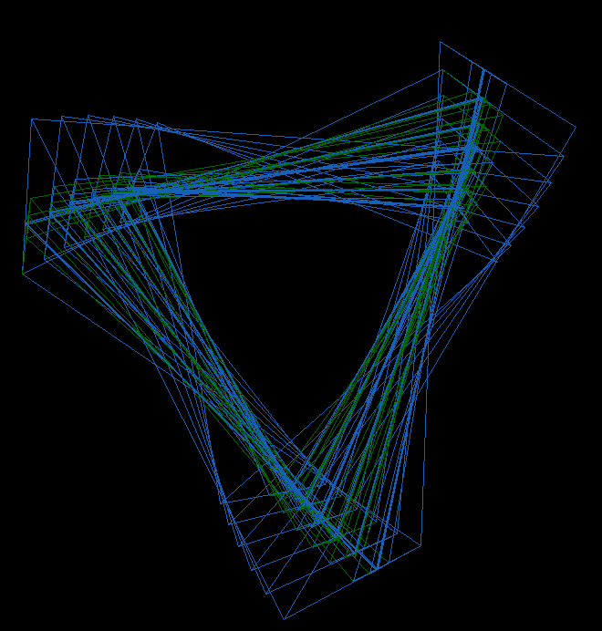
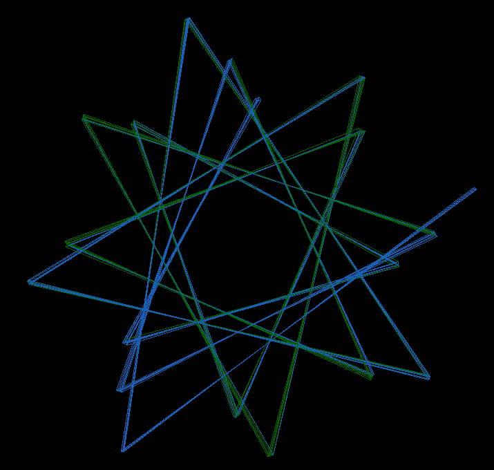

# Fdf (Fil de Fer)

This project aims exploring infography with the basic concept of drawing lines. We have to create a program able to take maps formated as below 

## Basic output

## Output on dense maps

## Weird output

A mistake during the development lead to an "artistic bonus" where the lines of the map are incorectly rotated. It lead to weirdly beautiful outputs.

### Final marck (125/125)